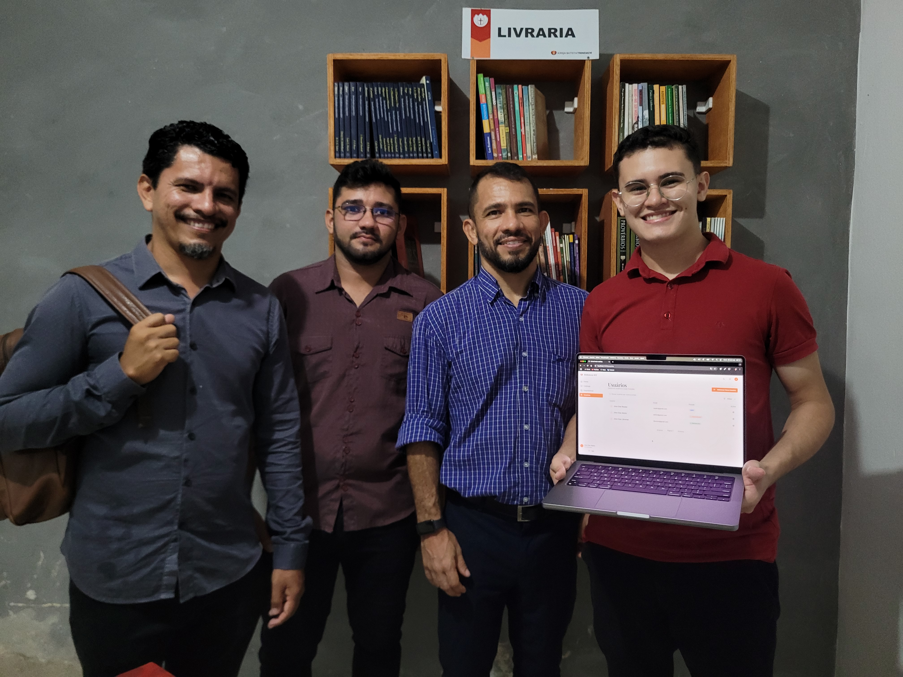

# Biblioteca IBT

Esse projeto tem como intuito fornecer um sistema capaz de controlar os empréstimos realizados na biblioteca da Igreja
Batista Trindade.

# Pré-requisitos

Como pré-requisito, você precisará ter instalado o [NodeJS](https://nodejs.org/en/download) em sua máquina.

# Configuração

Para realizar a configuração do projeto, você precisará realizar os seguintes passos:

1. Instalar as dependências necessárias com `npm install`
2. Criar um arquivo `.env` na pasta raiz do projeto e configurar a variável de ambiente `VITE_API_BASE_URL`.
    - Essa variável de ambiente se refere a URL base da API que o front-end consome.
3. Após isso, rode o projeto com o comando:

```shell
npm run dev
```

# Evidências

A seguir, fotos de evidência da apresentação e treinamento de uso do sistem aaos líderes da igreja.

<div align="center">
   
   
</div>
